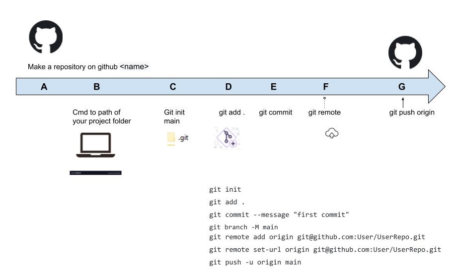

[Youtube video link for this turoial](https://www.youtube.com/watch?v=pyJDBiRmFRw)



```
git init
git checkout -b main
git add .
git commit --message "first commit"
git remote add origin git@github.com:javax4u/temp2.git
git remote set-url origin git@github.com:javax4u/temp2.git
git push -u origin main
```
